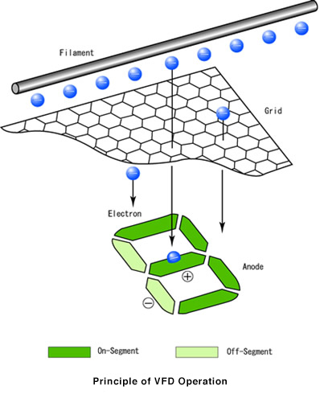
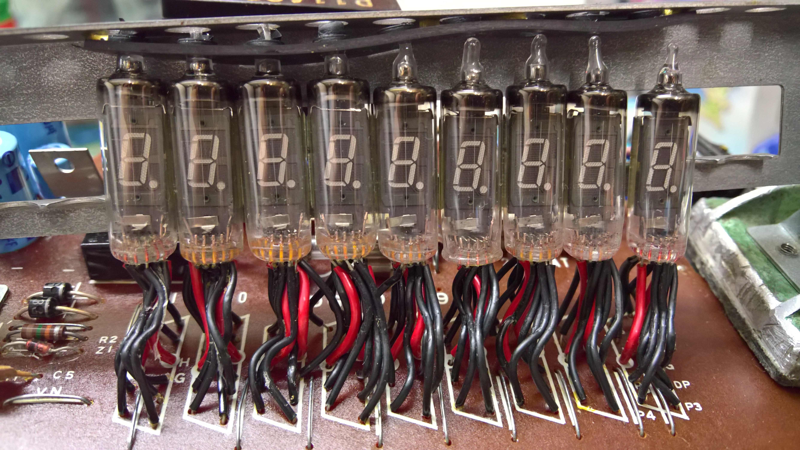
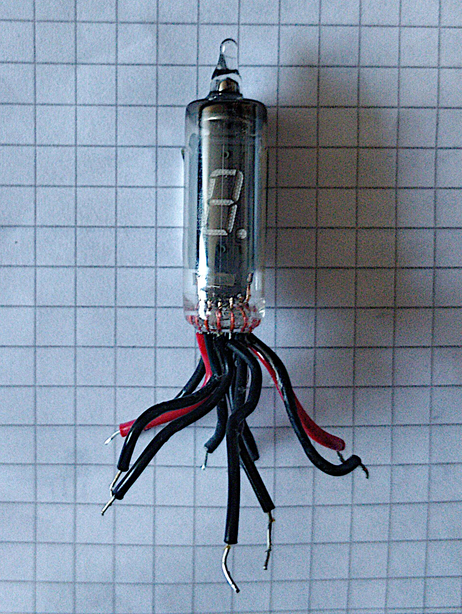

# Building a VFD clock

## VFD tubes

<!---->

The manufacturer has a [good explanation of the concept of VFD tubes](http://futaba.co.jp/en/display/vfd/index.html) on their website.

They basically work like this:
1. A *filament* (usually a Tungsten wire) is heated up and emits electrons into the vacuum in the tube.
2. The electrons are accelerated through a *grid* towards a positive-charged *anode*.
3. The electrons collide with the phosphor-coated anode and emit light due to [fluorescence](https://en.wikipedia.org/wiki/Fluorescence).

In the simplest case, the anodes make up an 8-figure consisting of seven individual segments plus a decimal point as an eigth segment.
[More complicated designs](http://futaba.co.jp/en/display/vfd/applications.html) such as combining multiple letters of different size, adding in symbols or [colors](https://en.wikipedia.org/wiki/Phosphorescence#Materials).

Each anode has its own wire leaving the casing.
The whole tube must be "activated" by setting the grid to a higher potential compared to the filament, which allows for multiplexing multiple tubes.

[Image Source: VFD | Futaba Corporation](http://futaba.co.jp/en/display/vfd/index.html)

## The tubes

I recently got ten VFD tubes labelled as **Futaba DG10Q1 3GS** out of an old calculator that was due for trash:

The manufacturer has been ["selling gas-discharge display tube in 1968"](http://futaba.co.jp/en/files/notice_20200805.pdf). Sadly, they want to leave the business until the end of this year (2021).

The tubes themselves look fantastic:

I wasn't able to find a datasheet online.

Image Source: Private work | Used with permission.

## Filament Driver
