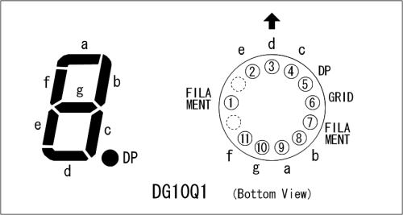

# About VFD tubes

<!---->

The manufacturer has a [good explanation of the concept of VFD tubes](http://futaba.co.jp/en/display/vfd/index.html) on their website.

They basically work like this:
1. A *filament* (usually a Tungsten wire) is heated up and emits electrons into the vacuum in the tube.
2. The electrons are accelerated through a *grid* towards a positive-charged *anode*.
3. The electrons collide with the phosphor-coated anode and emit light due to [fluorescence](https://en.wikipedia.org/wiki/Fluorescence).

In the simplest case, the anodes make up an 8-figure consisting of seven individual segments plus a decimal point as an eigth segment.
[More complicated designs](http://futaba.co.jp/en/display/vfd/applications.html) such as combining multiple letters of different size, adding in symbols or [colors](https://en.wikipedia.org/wiki/Phosphorescence#Materials).

Each anode has its own wire leaving the casing.
The whole tube must be "activated" by setting the grid to a higher potential compared to the filament, which allows for multiplexing multiple tubes.

Image Source: [VFD | Futaba Corporation](http://futaba.co.jp/en/display/vfd/index.html)

# The tubes

I recently got ten VFD tubes labelled as **Futaba DG10Q1 3GS** out of an old calculator that was due for trash:

The manufacturer has been ["selling gas-discharge display tube [since] 1968"](http://futaba.co.jp/en/files/notice_20200805.pdf). Sadly, they want to leave the business until the end of this year (2021).

The tubes themselves look fantastic:

Image Source: Used with permission, own work.

## Testing a tube

I wasn't able to find a datasheet online, only this image that circulates on the internet:

**Keep in mind that this is the bottom view.**

The filament in this tube is a thin wire in the front center that runs from the bottom to the top.
It glows orange-ish after applicating a high enough current to it. 

My tubes have a set of red-colored wires for the filament. If yours don't, try to find the pair of pins wich has the lowest resistance (lower than 10 ohms). 

Slowly increasing the voltage across these two pins, they started glowing at around 0.8 V.

As a next step, I applied 18 V to both the grid and a segment to see it glowing.

Image Source: [DG10Q1 | AsahiNet](https://ne.jp/asahi/shared/o-family/ElecRoom/PARTS/DISPLAY/ElDG10Q1.html)

# My final circuit

I am planning on combining multiple tubes to get a "smart" clock which is controlled by an atmega328 chip (the chip that is also used in an Arduino).
The atmega can then be combined with a Raspberry Pi which controls the displayed text. 

In the end, I'll need at least a 5 V power supply for the logic.

## The filament driver

The filament basically carries all the load of the tube.
I found that a single DG10Q1 consumes up to 50 mA at 1 V!

The easiest way would be to use a voltage regulator which creates 1 V from my 5 V supply.
However, many common voltage regulators use a reference voltage of 1.25 V (e.g. [LM317](https://ti.com/lit/ds/symlink/lm317.pdf) or [MAX1733](https://datasheets.maximintegrated.com/en/ds/MAX1733-MAX1734.pdf)) and can't be adjusted to anything below 1.25 V ([without an overly complicated circuit](https://electronics.stackexchange.com/questions/116842/very-low-voltage-regulator?newreg=f15bd3da58fc4a10ab08af88b5f3e868)).

Because of this issue, I am using a type of [current mirror circuit](https://wiki.analog.com/university/courses/electronics/text/chapter-11) instead:

Technically, it is used to mirror the amps from an input to the output.

However, with the correct value for R3, an arbitrary output voltage can be set.

*TODO: this is not correct and needs more work*

Image source: Own work.
